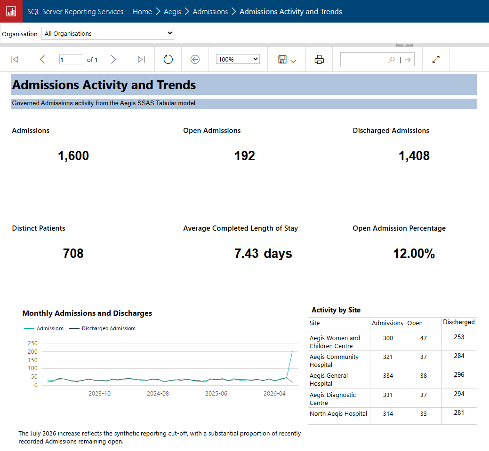

# Aegis Clinical Data Platform

**Aegis** is a synthetic NHS-style clinical data migration, validation, semantic-modelling, reporting and operational-assurance platform built on the Microsoft SQL Server data platform.

It demonstrates how established enterprise technologies such as SQL Server, SSIS, SSAS and SSRS can be delivered alongside Azure Data Factory, ADLS Gen2 and a self-hosted integration runtime using modern engineering practices including GitHub version control, database projects, repeatable testing, deterministic synthetic data, governed exception handling, least-privilege access and cloud-compatible design.

---

## Admissions migration scenario

The current implementation focuses on one complete end-to-end Admissions scenario:

```text
1,600 valid PAS admissions
+    5 controlled invalid admissions
-----------------------------------
1,605 admissions in one audited batch
```

The mixed SSIS package then processes:

```text
1,605 source rows
      ↓
1,605 landing rows
      ↓
1,605 staging rows
      ↓
1,600 accepted and curated
+    5 quarantined
+    5 data-quality exceptions
+    0 unexplained rows
```

Latest validated migration result:

| Metric | Result |
|---|---:|
| Source rows | 1,605 |
| Landing rows | 1,605 |
| Staging rows | 1,605 |
| Accepted / curated rows | 1,600 |
| Quarantined rows | 5 |
| Data-quality exceptions | 5 |
| Unexplained rows | 0 |
| Day 3 validation checks | 78 / 78 passed |

The five invalid Admissions each exercise a different validation rule:

| Rule | Scenario |
|---|---|
| `DQ-ADM-001` | Discharge before admission |
| `DQ-ADM-002` | Open admission contains discharge details |
| `DQ-ADM-003` | Discharged admission missing discharge details |
| `DQ-ADM-004` | Unknown patient |
| `DQ-ADM-005` | Unknown site or organisation |

---

## SSIS pipeline overview

### Control Flow — audited end-to-end orchestration

The Control Flow registers the batch and package execution, lands and stages Admissions, classifies every row, writes record outcomes and data-quality exceptions, materialises accepted and quarantined records, and finalises reconciliation.


### Data Flow — mixed SQL and controlled-defect ingestion

The mixed package combines 1,600 valid Admissions from `Aegis_Source` with five controlled defect rows from CSV. Both branches retain source provenance before being merged into a single audited landing flow.


---

## Azure Data Factory hybrid orchestration

Aegis also implements the Admissions migration through a hybrid Azure Data Factory route:

```text
ADLS Gen2
    ↓
Azure Data Factory
    ↓
Self-hosted Integration Runtime
    ↓
Local SQL Server
    ↓
Raw landing → typed landing → staging validation
    ↓
Curated / quarantine
    ↓
Audit outcomes and data-quality exceptions
```


The published pipeline is:

```text
PL_Load_Admissions_From_ADLS
```

Its successful path contains seven activities:

```text
SCR_Start_Admissions_Batch
        ↓
SP_Clear_Admissions_Raw
        ↓
CPY_Load_Admissions_To_Raw
        ↓
SCR_Promote_Admissions_Raw
        ↓
SCR_Process_Admissions
        ↓
SCR_Record_Admissions_Outcomes
        ↓
SP_Complete_Admissions_Batch
```

The final published run completed successfully through the live Data Factory service:


### Published-run reconciliation


| Control | Result |
|---|---:|
| Source rows | 1,605 |
| Landed rows | 1,605 |
| Staged rows | 1,605 |
| Accepted / curated rows | 1,600 |
| Quarantined rows | 5 |
| Record outcomes | 1,605 |
| Data-quality exceptions | 5 |
| Unexplained rows | 0 |

Final statuses:

```text
BatchStatus:      COMPLETED_WITH_EXCEPTIONS
ExecutionStatus:  SUCCEEDED_WITH_EXCEPTIONS
```

### Failure handling

A reusable child pipeline closes failed batch and package-execution audit records:

```text
PL_Fail_Admissions_Batch
```

Failure branches are attached to every downstream activity that can fail after batch registration. A controlled failure test proved that the handler:

- marks both audit records as `FAILED`;
- stores the ADF error code and failed activity;
- sets completion timestamps;
- prevents orphaned `PROCESSING` or `STARTED` records;
- preserves the first error when invoked repeatedly.


### GitHub-integrated development

ADF Studio is connected to the existing Aegis repository:

```text
Repository:            aegis
Collaboration branch:  dev
Publish branch:        adf_publish
Root folder:           /src/adf
```


ADF Studio is used for visual authoring, validation, Debug execution and publishing. ADF JSON resources are saved to GitHub under `src/adf`, while SQL projects, documentation and diagrams continue through the local VS Code workflow.

Detailed implementation documentation:

```text
docs/04_ETL/Azure_Data_Factory_Admissions_Orchestration.md
```

---

## SSAS Admissions analytical model

Aegis includes a focused SQL Server Analysis Services Tabular model over the accepted Admissions dataset produced by the audited SSIS pipeline.

The model provides a governed semantic layer for:

- accepted Admission activity;
- open versus discharged Admissions;
- admission and discharge trends;
- organisation and site analysis;
- patient classification and admission method;
- completed length of stay;
- source-to-curated migration lineage.


### Model structure

```text
Dim Organisation
        ↓
Dim Site
        ↓
Fact Admission

Dim Date
        ↓
Fact Admission
```

The Date dimension has two role-playing relationships:

- an active relationship to Admission Date;
- an inactive relationship to Discharge Date, activated through DAX with `USERELATIONSHIP`.

The model also contains reusable calendar hierarchies and chronological sort metadata for quarter, month, year-month and length-of-stay reporting.

### Validated analytical baseline

| Measure | Result |
|---|---:|
| Accepted Admissions | 1,600 |
| Open Admissions | 192 |
| Discharged Admissions | 1,408 |
| Distinct Patients | 708 |
| Average completed length of stay | 7.43 days |
| Open Admission percentage | 12.00% |

The model builds and deploys successfully to:

```text
Aegis_Admissions_Analysis
```

The deployed model has been independently validated using DAX.

SQL-side reporting validation also confirms:

```text
22 checks passed
0 checks failed
```

Detailed model documentation is available in:

```text
docs/06_Reporting/SSAS_Admissions_Tabular_Model.md
```

---


## SSRS Admissions operational report

Aegis includes a deployed SQL Server Reporting Services report over the governed Admissions semantic model.

The implemented report is:

```text
Admissions Activity and Trends
```

It provides:

- six governed Admissions KPIs;
- monthly Admission and discharge trends;
- organisation filtering;
- site-level activity and reconciliation;
- parameter-driven views over the SSAS Tabular model;
- single-page A4 landscape rendering in the SSRS web portal.



### Validated report baseline

| Measure | Result |
|---|---:|
| Admissions | 1,600 |
| Open Admissions | 192 |
| Discharged Admissions | 1,408 |
| Distinct Patients | 708 |
| Average completed length of stay | 7.43 days |
| Open Admission percentage | 12.00% |

The report includes an `All Organisations` default together with three synthetic organisation selections.

For example, filtering to `Aegis University Hospitals NHS Trust` produces:

| Measure | Result |
|---|---:|
| Admissions | 655 |
| Open Admissions | 75 |
| Discharged Admissions | 580 |
| Distinct Patients | 447 |
| Average completed length of stay | 7.38 days |
| Open Admission percentage | 11.45% |

The filtered site totals reconcile exactly to the filtered KPI totals.

The report builds and deploys successfully to:

```text
http://localhost/reportserver
```

under:

```text
Aegis
└── Admissions
    └── Admissions Activity and Trends
```

Detailed report documentation is available in:

```text
docs/06_Reporting/SSRS_Admissions_Operational_Report.md
```

---

## Implemented architecture

```text
Synthetic legacy PAS
├── Aegis_Source.pas.Admission
└── admission_defects.csv
            │
            ├─────────────────────────────────────┐
            │                                     │
            ▼                                     ▼
PKG_Load_Admission_Mixed.dtsx          ADLS Gen2 admission_mixed.csv
            │                                     │
            │                                     ▼
            │                          PL_Load_Admissions_From_ADLS
            │                                     │
            └───────────────┬─────────────────────┘
                            ▼
                  Aegis_Staging landing
                            │
                            ▼
                     stg.Admission
                            │
             ┌──────────────┴──────────────┐
             ▼                             ▼
   curated.Admission              quarantine.Admission
             │
             ▼
 reporting.AdmissionAnalysis
             │
             ▼
 Aegis_Admissions_Analysis
 SSAS Tabular semantic model
             │
             ▼
 SSRS Admissions Activity and Trends

Operational evidence
├── Aegis_Audit.audit.Batch
├── Aegis_Audit.audit.PackageExecution
├── Aegis_Audit.audit.RecordOutcome
├── Aegis_Audit.dq.ValidationRule
└── Aegis_Audit.dq.DataQualityException
```

The core migration principle is:

> Preserve the imperfect legacy source, detect and classify defects in staging, process what is valid, quarantine what is unsafe, and reconcile every outcome.

The orchestration principle is:

> Keep validation and migration logic in version-controlled SQL projects while using SSIS or Azure Data Factory to coordinate repeatable, auditable execution.

The analytical principle is:

> Report from governed accepted data through a stable reporting contract and validated semantic model, rather than directly from an uncontrolled legacy source.

---

## Implemented SQL Server databases and services

| Database or service | Purpose | Status |
|---|---|---|
| `Aegis_Source` | Synthetic legacy PAS source and reference data | Implemented and populated |
| `Aegis_Staging` | Landing, staging, curated, quarantine and reporting layers | Implemented and populated |
| `Aegis_Audit` | Batch, package, row-outcome and data-quality audit | Implemented and populated |
| `Aegis_Admissions_Analysis` | SSAS Tabular Admissions semantic model | Implemented, deployed and validated |
| `Admissions Activity and Trends` | SSRS operational Admissions report | Implemented, deployed and validated |
| `adf-aegis-dev-ukfi` | Azure Data Factory hybrid Admissions orchestration | Implemented, Git-integrated, published and validated |
| `staegisdevukfi` | ADLS Gen2 Admissions landing | Implemented and validated |
| `shir-aegis-dev-ukfi` | Secure bridge from ADF to local SQL Server | Implemented and running |
| `Aegis_Warehouse` | Broader future analytical warehouse | Deferred |
| `Aegis_Reporting` | Potential future relational reporting database | Deferred |

The implemented relational databases are managed through SQL Server Database DevOps projects and deployed through repeatable DACPAC build and publish workflows.

The SSAS model is managed through a Visual Studio Analysis Services Tabular project and deployed to the local SQL Server Analysis Services instance.

The SSRS report is managed through a Visual Studio Report Server project and deployed to the local SQL Server Reporting Services web portal.

The ADF implementation is authored visually in ADF Studio, stored as JSON under `src/adf`, published to the live Data Factory service and executed through a self-hosted integration runtime against the same version-controlled SQL processing layer.

---

## Implemented SSIS packages

### `PKG_Load_Admissions.dtsx`

Processes the 1,600-row valid SQL-source baseline and proves the clean acceptance path.

### `PKG_Load_Admission_Defects.dtsx`

Processes the five controlled defect rows and proves each validation and quarantine path independently.

### `PKG_Load_Admission_Mixed.dtsx`

Combines the valid and controlled-defect sources into one realistic operational batch and proves:

- SQL and flat-file ingestion;
- timestamp normalisation and conversion;
- nullable timestamp handling;
- conditional splitting;
- source provenance;
- Union All processing;
- batch and package auditing;
- row-level outcome audit;
- data-quality exception logging;
- accepted-row materialisation;
- quarantine materialisation;
- complete source-to-outcome reconciliation.

Package-level `OnError` handlers automatically close failed batch and package executions with captured SSIS runtime error details, preventing orphaned `PROCESSING` or `STARTED` records.

---

## Implemented Azure Data Factory solution

ADF source-controlled resources are stored under:

```text
src/adf/
├── dataset/
├── factory/
├── integrationRuntime/
├── linkedService/
├── pipeline/
└── publish_config.json
```

The implementation contains:

```text
PL_Load_Admissions_From_ADLS
PL_Fail_Admissions_Batch
```

and demonstrates:

- ADLS Gen2 delimited-file ingestion;
- self-hosted integration runtime connectivity;
- hybrid Azure-to-local SQL orchestration;
- parameterised batch registration;
- raw-table clearing and repeatable re-execution;
- safe promotion from permissive raw strings to typed landing;
- reference lookups against `Aegis_Source`;
- staging validation and classification;
- curated and quarantine materialisation;
- row-outcome and DQ-exception audit;
- actual upstream count propagation into completion audit;
- reusable failure handling;
- idempotent failure closure;
- least-privilege SQL permissions;
- ADF Git integration using `dev`, `main` and `adf_publish`;
- published-service execution and monitoring.

The SQL login used by ADF is:

```text
aegis_adf_loader
```

Its object-level permissions are represented through post-deployment scripts in all three database projects. No password is stored in Git or documentation.

---

## Implemented SSAS model

The SSAS Tabular solution is:

```text
src/ssas/Aegis.Analysis/Aegis.Analysis.sln
```

The model contains:

```text
Fact Admission
Dim Organisation
Dim Site
Dim Date
```

Implemented measures include:

```text
Admissions
Open Admissions
Discharged Admissions
Distinct Patients
Average Completed Length of Stay
Open Admission Percentage
```

The model demonstrates:

- tabular semantic modelling;
- one-to-many dimension relationships;
- organisation-to-site snowflake filtering;
- active and inactive role-playing date relationships;
- DAX `USERELATIONSHIP`;
- calculated date tables;
- reusable date hierarchies;
- chronological sort metadata;
- hidden technical and helper columns;
- reporting-friendly descriptions;
- deployed-model DAX validation;
- least-privilege processing credentials.

A dedicated read-only SQL login is used for model processing:

```text
aegis_ssas_reader
```

Its password is not stored in Git or documentation.

---


## Implemented SSRS report

The SSRS solution is:

```text
src/ssrs/Aegis.Reporting/Aegis.Reporting.sln
```

The SSRS project is:

```text
src/ssrs/Aegis.Reporting/Aegis.Admissions.Reporting
```

The project contains:

```text
Reports/
└── Admissions Activity and Trends.rdl

Shared Data Sources/
└── DS_Aegis_Admissions_Analysis.rds
```

The report contains four embedded datasets:

```text
DS_KPI_Summary
DS_Monthly_Activity
DS_Organisation_Site_Activity
DS_Organisation_Parameter
```

It demonstrates:

- SSRS paginated-report development;
- Analysis Services shared data sources;
- DAX-backed datasets;
- multiple dataset contexts;
- List and Tablix data regions;
- parameter-driven filtering;
- organisation-aware KPI and chart queries;
- site-level Tablix filtering;
- line-chart rendering;
- single-page A4 landscape layout;
- local report-server deployment;
- deployed portal validation.

The report is intentionally focused on one polished operational view. Additional Open Admissions, migration-reconciliation and data-quality reports remain suitable future extensions.

---

## Synthetic source-data baseline

The deterministic source database currently contains:

| Domain | Object | Rows |
|---|---|---:|
| Reference | Organisations | 3 |
| Reference | Sites | 5 |
| Reference | Specialties | 12 |
| Reference | Consultants | 36 |
| Reference | Wards | 24 |
| Patient | Patients | 1,000 |
| Identity | Patient identifiers | 2,170 |
| Identity | Patient merges | 25 |
| Activity | Admissions | 1,600 |
| Activity | Consultant episodes | 3,125 |
| Activity | Diagnoses | 7,797 |
| Activity | Procedures | 2,150 |
| Activity | Ward stays | 3,211 |

The current interview-focused implementation deliberately takes **Admissions** through the complete migration, assurance and semantic-modelling lifecycle.

The remaining PAS activity domains are retained for later expansion using the proven Admissions template.

---

## Validation evidence

Aegis currently contains four repeatable SQL validation suites:

| Validation suite | Result |
|---|---:|
| Source schema foundation | 56 / 56 |
| Day 2 source-data reconciliation | 63 / 63 |
| Day 3 migration control plane | 78 / 78 |
| Day 4 Admissions reporting layer | 22 / 22 |
| **Combined executed SQL checks** | **219 / 219** |

The Day 3 validation suite confirms:

- database and schema deployment;
- audit and data-quality structures;
- landing, staging, curated and quarantine tables;
- valid baseline processing;
- controlled defect processing;
- mixed-batch processing;
- automatic failure-audit behaviour;
- five distinct data-quality rule outcomes;
- source provenance;
- full count reconciliation;
- no unexplained records.

The Day 4 SQL validation confirms:

- reporting schema and view deployment;
- reporting-to-curated reconciliation;
- accepted, open and discharged totals;
- distinct-patient totals;
- admission and discharge date ranges;
- completed length-of-stay calculations;
- lineage completeness;
- organisation and site references;
- site-to-organisation consistency.

The deployed SSAS model is independently validated through:

```text
src/ssas/Aegis.Analysis/validation/validate_aegis_admissions_model.dax
```

This proves:

- core model measures;
- organisation and site filtering;
- active Admission Date behaviour;
- inactive Discharge Date behaviour;
- yearly admission and discharge trends.

---

## Technology stack

- SQL Server 2022 Developer Edition
- SQL Server Management Studio 22
- SQL Server Database DevOps projects
- DACPAC build and publish
- SQL Server Integration Services
- SQL Server Analysis Services Tabular
- SQL Server Reporting Services
- Azure Data Factory
- Azure Data Lake Storage Gen2
- Self-hosted Integration Runtime
- Visual Studio 2022 and SSDT
- Visual Studio Code
- T-SQL
- DAX
- Python 3.13
- Faker
- pyodbc
- PowerShell
- Git and GitHub
- Azure SQL Database
- Power BI

---

## Repository structure

```text
aegis/
├── data/
│   ├── generated/
│   ├── generators/
│   └── private/
├── diagrams/
│   └── adf/
├── docs/
│   ├── 00_Project/
│   ├── 01_Architecture/
│   ├── 02_Data_Contracts/
│   ├── 03_Data_Model/
│   ├── 04_ETL/
│   ├── 05_Migration/
│   ├── 06_Reporting/
│   ├── 07_HA_DR/
│   ├── 08_Testing/
│   ├── 09_Operations/
│   └── 10_Governance/
├── images/
│   ├── adf/
│   ├── architecture/
│   ├── database/
│   ├── log_shipping/
│   ├── replication/
│   ├── ssas/
│   ├── ssis/
│   └── ssrs/
├── sql/
│   ├── administration/
│   ├── deployment/
│   ├── monitoring/
│   └── tests/
├── src/
│   ├── adf/
│   ├── database/
│   ├── ssas/
│   │   └── Aegis.Analysis/
│   ├── ssis/
│   ├── ssrs/
│   │   └── Aegis.Reporting/
│   └── synthetic_data/
├── .gitignore
└── requirements.txt
```

Generated build outputs such as `bin`, `obj` and DACPAC files are excluded from normal Git history.

---

## Data governance

Only fully synthetic data may be committed to this public repository.

The project must never publish:

- real patient data;
- pseudonymised or anonymised extracts derived from real individuals;
- real NHS numbers;
- production HL7 or FHIR messages;
- real staff identifiers;
- passwords, secrets or private connection strings;
- production screenshots containing identifiable information.

All generated NHS-number-like values deliberately fail NHS checksum validation.

Private structural reference material remains under:

```text
data/private
```

and is excluded from Git.

Aegis is intended to demonstrate governance principles as well as technical delivery, including:

- controlled data ownership;
- source-to-target lineage;
- deterministic test data;
- data-quality rule catalogues;
- quarantined exceptions;
- least-privilege access;
- repeatable reconciliation;
- documented analytical contracts.

---

## Current delivery status

### Complete

- SQL Server development platform
- GitHub repository and branching workflow
- SQL database projects
- deterministic synthetic PAS source model
- patient identity and merge modelling
- deterministic patient and activity generation
- controlled Admissions defects
- `Aegis_Staging`
- `Aegis_Audit`
- SSIS valid, defect-only and mixed packages
- accepted and quarantine physical layers
- batch, package, row-outcome and data-quality auditing
- automatic SSIS failure auditing
- ADLS Gen2 Admissions landing
- Azure Data Factory hybrid Admissions orchestration
- self-hosted integration runtime connectivity
- published seven-stage ADF pipeline
- reusable ADF failure-handling pipeline
- controlled ADF failure closure and idempotency validation
- source-controlled least-privilege ADF permissions
- ADF GitHub integration under `src/adf`
- successful published ADF trigger execution
- ADF reconciliation with 0 unexplained rows
- realistic mixed Admissions reconciliation
- Admissions reporting schema and analytical view
- focused SSAS Tabular Admissions model
- organisation, site and calculated date dimensions
- active Admission Date and inactive Discharge Date relationships
- DAX measures and date hierarchies
- least-privilege SSAS processing account
- successful SSAS build and deployment
- deployed-model DAX validation
- SSAS model documentation and README visual
- SSRS Admissions Activity and Trends report
- organisation parameter with All Organisations default
- KPI, monthly trend and site-level filtering
- successful SSRS build and deployment
- deployed SSRS portal validation
- SSRS report documentation and README visual
- 219 / 219 combined SQL validation checks passed

### Next

- complete the `v0.6.0` documentation, validation and release;
- retain the completed Admissions solution as a stable portfolio baseline;
- select the next focused enhancement based on interview relevance and portfolio value.

Microsoft Purview implementation remains deferred because the required Data Map and Unified Catalog capabilities were not available within the current low-cost development setup.

### Later roadmap

- consultant episode, diagnosis, procedure and ward-stay migration templates
- patient merge processing through downstream migration layers
- controlled replay implementation
- HL7 ADT and FHIR ingestion
- broader warehouse and statutory-style reporting extracts
- transactional replication
- log shipping and recovery demonstration
- Azure SQL compatibility and deployment demonstration
- Power BI management summary
- additional SSRS reports for Open Admissions, reconciliation and data quality
- quarantined Admission and source-to-curated detail
- Microsoft Purview governance demonstration using Data Map and Unified Catalog concepts for clinical-data discovery, classification, ownership and lineage
- deeper governance discussion and Purview scope review following the completed SSRS implementation

The later roadmap is deliberately deferred so that the current Admissions scenario remains polished, explainable and achievable as an end-to-end interview demonstration.

---

## Key documentation

- [Project Scope](docs/00_Project/Project_Scope.md)
- [Delivery Plan](docs/00_Project/Delivery_Plan.md)
- [Solution Architecture](docs/01_Architecture/Solution_Architecture.md)
- [Interface Inventory](docs/04_ETL/Interface_Inventory.md)
- [Azure Data Factory Admissions Orchestration](docs/04_ETL/Azure_Data_Factory_Admissions_Orchestration.md)
- [SSAS Admissions Tabular Model](docs/06_Reporting/SSAS_Admissions_Tabular_Model.md)
- [SSRS Admissions Operational Report](docs/06_Reporting/SSRS_Admissions_Operational_Report.md)
- [Synthetic Data Governance](docs/10_Governance/Synthetic_Data_Generation_and_Safety_Rules.md)
- [Master Context](docs/00_Project/AEGIS_MASTER_CONTEXT.md)

---

## Related portfolio project

Aegis complements [Atlas](https://github.com/johnmccrae-ukfi/atlas), a Microsoft Fabric enterprise AI intelligence platform.

- **Atlas** demonstrates cloud-native data engineering, real-time analytics, semantic modelling and AI.
- **Aegis** demonstrates SQL Server, SSIS, SSAS, SSRS, Azure Data Factory, ADLS Gen2, hybrid integration, clinical migration, data quality, governance and operational assurance.