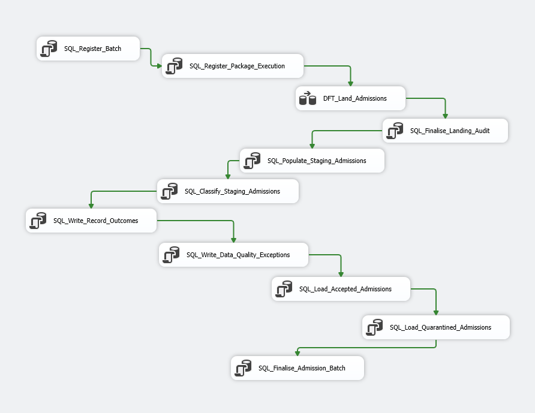
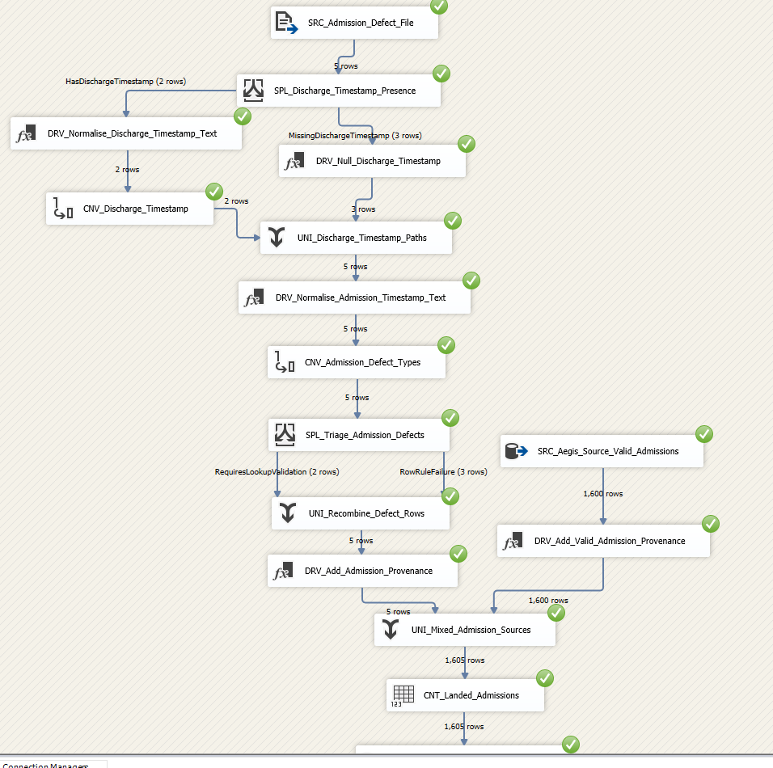

# Aegis Clinical Data Platform

**Aegis** is a synthetic NHS-style clinical data migration, validation, semantic-modelling, reporting and operational-assurance platform built on the Microsoft SQL Server data platform.

It demonstrates how established enterprise technologies such as SQL Server, SSIS, SSAS and SSRS can be delivered using modern engineering practices including GitHub version control, database projects, repeatable testing, deterministic synthetic data, governed exception handling, least-privilege access and cloud-compatible design.

---

## Admissions migration scenario

The current implementation focuses on one complete end-to-end Admissions scenario:

```text
1,600 valid PAS admissions
+    5 controlled invalid admissions
-----------------------------------
1,605 admissions in one audited batch
```

The mixed SSIS package then processes:

```text
1,605 source rows
      ↓
1,605 landing rows
      ↓
1,605 staging rows
      ↓
1,600 accepted and curated
+    5 quarantined
+    5 data-quality exceptions
+    0 unexplained rows
```

Latest validated migration result:

| Metric | Result |
|---|---:|
| Source rows | 1,605 |
| Landing rows | 1,605 |
| Staging rows | 1,605 |
| Accepted / curated rows | 1,600 |
| Quarantined rows | 5 |
| Data-quality exceptions | 5 |
| Unexplained rows | 0 |
| Day 3 validation checks | 78 / 78 passed |

The five invalid Admissions each exercise a different validation rule:

| Rule | Scenario |
|---|---|
| `DQ-ADM-001` | Discharge before admission |
| `DQ-ADM-002` | Open admission contains discharge details |
| `DQ-ADM-003` | Discharged admission missing discharge details |
| `DQ-ADM-004` | Unknown patient |
| `DQ-ADM-005` | Unknown site or organisation |

---

## SSIS pipeline overview

### Control Flow — audited end-to-end orchestration

The Control Flow registers the batch and package execution, lands and stages Admissions, classifies every row, writes record outcomes and data-quality exceptions, materialises accepted and quarantined records, and finalises reconciliation.



### Data Flow — mixed SQL and controlled-defect ingestion

The mixed package combines 1,600 valid Admissions from `Aegis_Source` with five controlled defect rows from CSV. Both branches retain source provenance before being merged into a single audited landing flow.



---

## SSAS Admissions analytical model

Aegis includes a focused SQL Server Analysis Services Tabular model over the accepted Admissions dataset produced by the audited SSIS pipeline.

The model provides a governed semantic layer for:

- accepted Admission activity;
- open versus discharged Admissions;
- admission and discharge trends;
- organisation and site analysis;
- patient classification and admission method;
- completed length of stay;
- source-to-curated migration lineage.


### Model structure

```text
Dim Organisation
        ↓
Dim Site
        ↓
Fact Admission

Dim Date
        ↓
Fact Admission
```

The Date dimension has two role-playing relationships:

- an active relationship to Admission Date;
- an inactive relationship to Discharge Date, activated through DAX with `USERELATIONSHIP`.

The model also contains reusable calendar hierarchies and chronological sort metadata for quarter, month, year-month and length-of-stay reporting.

### Validated analytical baseline

| Measure | Result |
|---|---:|
| Accepted Admissions | 1,600 |
| Open Admissions | 192 |
| Discharged Admissions | 1,408 |
| Distinct Patients | 708 |
| Average completed length of stay | 7.43 days |
| Open Admission percentage | 12.00% |

The model builds and deploys successfully to:

```text
Aegis_Admissions_Analysis
```

The deployed model has been independently validated using DAX.

SQL-side reporting validation also confirms:

```text
22 checks passed
0 checks failed
```

Detailed model documentation is available in:

```text
docs/06_Reporting/SSAS_Admissions_Tabular_Model.md
```

---

## Implemented architecture

```text
Synthetic legacy PAS
├── Aegis_Source.pas.Admission
└── admission_defects.csv
            │
            ▼
PKG_Load_Admission_Mixed.dtsx
            │
            ▼
Aegis_Staging.landing.Admission
            │
            ▼
Aegis_Staging.stg.Admission
            │
            ├── valid
            │      ▼
            │  Aegis_Staging.curated.Admission
            │      │
            │      ▼
            │  Aegis_Staging.reporting.AdmissionAnalysis
            │      │
            │      ▼
            │  Aegis_Admissions_Analysis
            │  SSAS Tabular semantic model
            │
            └── invalid
                   ▼
               Aegis_Staging.quarantine.Admission

Operational evidence
├── Aegis_Audit.audit.Batch
├── Aegis_Audit.audit.PackageExecution
├── Aegis_Audit.audit.RecordOutcome
├── Aegis_Audit.dq.ValidationRule
└── Aegis_Audit.dq.DataQualityException
```

The core migration principle is:

> Preserve the imperfect legacy source, detect and classify defects in staging, process what is valid, quarantine what is unsafe, and reconcile every outcome.

The analytical principle is:

> Report from governed accepted data through a stable reporting contract and validated semantic model, rather than directly from an uncontrolled legacy source.

---

## Implemented SQL Server databases and services

| Database or service | Purpose | Status |
|---|---|---|
| `Aegis_Source` | Synthetic legacy PAS source and reference data | Implemented and populated |
| `Aegis_Staging` | Landing, staging, curated, quarantine and reporting layers | Implemented and populated |
| `Aegis_Audit` | Batch, package, row-outcome and data-quality audit | Implemented and populated |
| `Aegis_Admissions_Analysis` | SSAS Tabular Admissions semantic model | Implemented, deployed and validated |
| `Aegis_Warehouse` | Broader future analytical warehouse | Deferred |
| `Aegis_Reporting` | Potential future relational reporting database | Deferred |

The implemented relational databases are managed through SQL Server Database DevOps projects and deployed through repeatable DACPAC build and publish workflows.

The SSAS model is managed through a Visual Studio Analysis Services Tabular project and deployed to the local SQL Server Analysis Services instance.

---

## Implemented SSIS packages

### `PKG_Load_Admissions.dtsx`

Processes the 1,600-row valid SQL-source baseline and proves the clean acceptance path.

### `PKG_Load_Admission_Defects.dtsx`

Processes the five controlled defect rows and proves each validation and quarantine path independently.

### `PKG_Load_Admission_Mixed.dtsx`

Combines the valid and controlled-defect sources into one realistic operational batch and proves:

- SQL and flat-file ingestion;
- timestamp normalisation and conversion;
- nullable timestamp handling;
- conditional splitting;
- source provenance;
- Union All processing;
- batch and package auditing;
- row-level outcome audit;
- data-quality exception logging;
- accepted-row materialisation;
- quarantine materialisation;
- complete source-to-outcome reconciliation.

Package-level `OnError` handlers automatically close failed batch and package executions with captured SSIS runtime error details, preventing orphaned `PROCESSING` or `STARTED` records.

---

## Implemented SSAS model

The SSAS Tabular solution is:

```text
src/ssas/Aegis.Analysis/Aegis.Analysis.sln
```

The model contains:

```text
Fact Admission
Dim Organisation
Dim Site
Dim Date
```

Implemented measures include:

```text
Admissions
Open Admissions
Discharged Admissions
Distinct Patients
Average Completed Length of Stay
Open Admission Percentage
```

The model demonstrates:

- tabular semantic modelling;
- one-to-many dimension relationships;
- organisation-to-site snowflake filtering;
- active and inactive role-playing date relationships;
- DAX `USERELATIONSHIP`;
- calculated date tables;
- reusable date hierarchies;
- chronological sort metadata;
- hidden technical and helper columns;
- reporting-friendly descriptions;
- deployed-model DAX validation;
- least-privilege processing credentials.

A dedicated read-only SQL login is used for model processing:

```text
aegis_ssas_reader
```

Its password is not stored in Git or documentation.

---

## Synthetic source-data baseline

The deterministic source database currently contains:

| Domain | Object | Rows |
|---|---|---:|
| Reference | Organisations | 3 |
| Reference | Sites | 5 |
| Reference | Specialties | 12 |
| Reference | Consultants | 36 |
| Reference | Wards | 24 |
| Patient | Patients | 1,000 |
| Identity | Patient identifiers | 2,170 |
| Identity | Patient merges | 25 |
| Activity | Admissions | 1,600 |
| Activity | Consultant episodes | 3,125 |
| Activity | Diagnoses | 7,797 |
| Activity | Procedures | 2,150 |
| Activity | Ward stays | 3,211 |

The current interview-focused implementation deliberately takes **Admissions** through the complete migration, assurance and semantic-modelling lifecycle.

The remaining PAS activity domains are retained for later expansion using the proven Admissions template.

---

## Validation evidence

Aegis currently contains four repeatable SQL validation suites:

| Validation suite | Result |
|---|---:|
| Source schema foundation | 56 / 56 |
| Day 2 source-data reconciliation | 63 / 63 |
| Day 3 migration control plane | 78 / 78 |
| Day 4 Admissions reporting layer | 22 / 22 |
| **Combined executed SQL checks** | **219 / 219** |

The Day 3 validation suite confirms:

- database and schema deployment;
- audit and data-quality structures;
- landing, staging, curated and quarantine tables;
- valid baseline processing;
- controlled defect processing;
- mixed-batch processing;
- automatic failure-audit behaviour;
- five distinct data-quality rule outcomes;
- source provenance;
- full count reconciliation;
- no unexplained records.

The Day 4 SQL validation confirms:

- reporting schema and view deployment;
- reporting-to-curated reconciliation;
- accepted, open and discharged totals;
- distinct-patient totals;
- admission and discharge date ranges;
- completed length-of-stay calculations;
- lineage completeness;
- organisation and site references;
- site-to-organisation consistency.

The deployed SSAS model is independently validated through:

```text
src/ssas/Aegis.Analysis/validation/validate_aegis_admissions_model.dax
```

This proves:

- core model measures;
- organisation and site filtering;
- active Admission Date behaviour;
- inactive Discharge Date behaviour;
- yearly admission and discharge trends.

---

## Technology stack

- SQL Server 2022 Developer Edition
- SQL Server Management Studio 22
- SQL Server Database DevOps projects
- DACPAC build and publish
- SQL Server Integration Services
- SQL Server Analysis Services Tabular
- SQL Server Reporting Services
- Visual Studio 2022 and SSDT
- Visual Studio Code
- T-SQL
- DAX
- Python 3.13
- Faker
- pyodbc
- PowerShell
- Git and GitHub
- Azure SQL Database
- Power BI

---

## Repository structure

```text
aegis/
├── data/
│   ├── generated/
│   ├── generators/
│   └── private/
├── docs/
│   ├── 00_Project/
│   ├── 01_Architecture/
│   ├── 02_Data_Contracts/
│   ├── 03_Data_Model/
│   ├── 04_ETL/
│   ├── 05_Migration/
│   ├── 06_Reporting/
│   ├── 07_HA_DR/
│   ├── 08_Testing/
│   ├── 09_Operations/
│   └── 10_Governance/
├── images/
│   ├── architecture/
│   ├── database/
│   ├── log_shipping/
│   ├── replication/
│   ├── ssas/
│   ├── ssis/
│   └── ssrs/
├── sql/
│   ├── administration/
│   ├── deployment/
│   ├── monitoring/
│   └── tests/
├── src/
│   ├── database/
│   ├── ssas/
│   │   └── Aegis.Analysis/
│   ├── ssis/
│   └── synthetic_data/
├── .gitignore
└── requirements.txt
```

Generated build outputs such as `bin`, `obj` and DACPAC files are excluded from normal Git history.

---

## Data governance

Only fully synthetic data may be committed to this public repository.

The project must never publish:

- real patient data;
- pseudonymised or anonymised extracts derived from real individuals;
- real NHS numbers;
- production HL7 or FHIR messages;
- real staff identifiers;
- passwords, secrets or private connection strings;
- production screenshots containing identifiable information.

All generated NHS-number-like values deliberately fail NHS checksum validation.

Private structural reference material remains under:

```text
data/private
```

and is excluded from Git.

Aegis is intended to demonstrate governance principles as well as technical delivery, including:

- controlled data ownership;
- source-to-target lineage;
- deterministic test data;
- data-quality rule catalogues;
- quarantined exceptions;
- least-privilege access;
- repeatable reconciliation;
- documented analytical contracts.

---

## Current delivery status

### Complete

- SQL Server development platform
- GitHub repository and branching workflow
- SQL database projects
- deterministic synthetic PAS source model
- patient identity and merge modelling
- deterministic patient and activity generation
- controlled Admissions defects
- `Aegis_Staging`
- `Aegis_Audit`
- SSIS valid, defect-only and mixed packages
- accepted and quarantine physical layers
- batch, package, row-outcome and data-quality auditing
- automatic SSIS failure auditing
- realistic mixed Admissions reconciliation
- Admissions reporting schema and analytical view
- focused SSAS Tabular Admissions model
- organisation, site and calculated date dimensions
- active Admission Date and inactive Discharge Date relationships
- DAX measures and date hierarchies
- least-privilege SSAS processing account
- successful SSAS build and deployment
- deployed-model DAX validation
- SSAS model documentation and README visual
- 219 / 219 combined SQL validation checks passed

### Next — SSRS Admissions reporting

- Admissions Activity and Trends report
- Open Admissions and Length of Stay report
- Migration Reconciliation and Data Quality report
- quarantined Admission detail where useful
- source-to-curated lineage detail where useful
- report deployment to the SSRS web portal
- final Day 5 validation
- interview walkthrough and release documentation

### Later roadmap

- consultant episode, diagnosis, procedure and ward-stay migration templates
- patient merge processing through downstream migration layers
- controlled replay implementation
- HL7 ADT and FHIR ingestion
- broader warehouse and statutory-style reporting extracts
- transactional replication
- log shipping and recovery demonstration
- Azure SQL compatibility and deployment demonstration
- Power BI management summary
- Microsoft Purview governance demonstration using Data Map and Unified Catalog concepts for clinical-data discovery, classification, ownership and lineage
- deeper governance discussion and Purview scope review after the Day 5 SSRS implementation

The later roadmap is deliberately deferred so that the current Admissions scenario remains polished, explainable and achievable as an end-to-end interview demonstration.

---

## Key documentation

- [Project Scope](docs/00_Project/Project_Scope.md)
- [Delivery Plan](docs/00_Project/Delivery_Plan.md)
- [Solution Architecture](docs/01_Architecture/Solution_Architecture.md)
- [Interface Inventory](docs/04_ETL/Interface_Inventory.md)
- [SSAS Admissions Tabular Model](docs/06_Reporting/SSAS_Admissions_Tabular_Model.md)
- [Synthetic Data Governance](docs/10_Governance/Synthetic_Data_Generation_and_Safety_Rules.md)
- [Master Context](docs/00_Project/AEGIS_MASTER_CONTEXT.md)

---

## Related portfolio project

Aegis complements [Atlas](https://github.com/johnmccrae-ukfi/atlas), a Microsoft Fabric enterprise AI intelligence platform.

- **Atlas** demonstrates cloud-native data engineering, real-time analytics, semantic modelling and AI.
- **Aegis** demonstrates SQL Server, SSIS, SSAS, SSRS, clinical migration, data quality, governance and operational assurance.