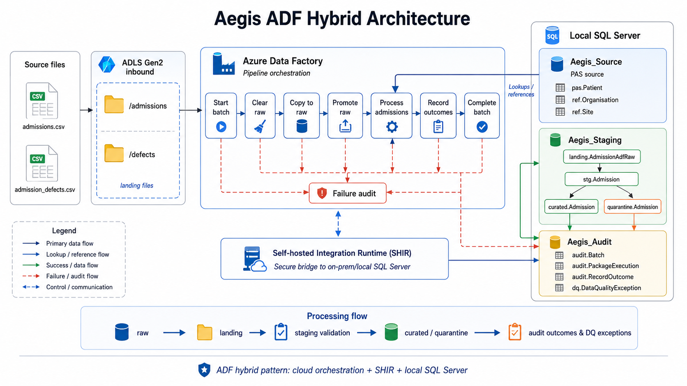
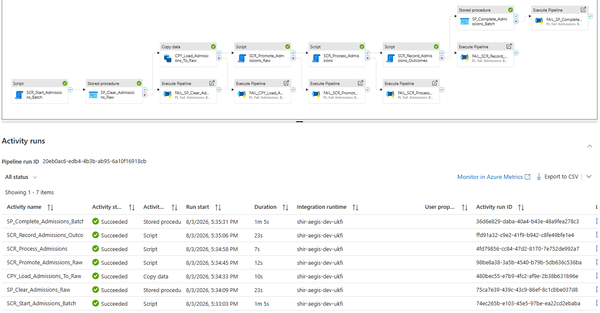
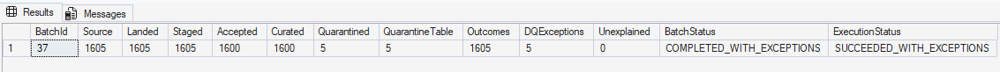
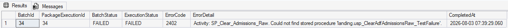
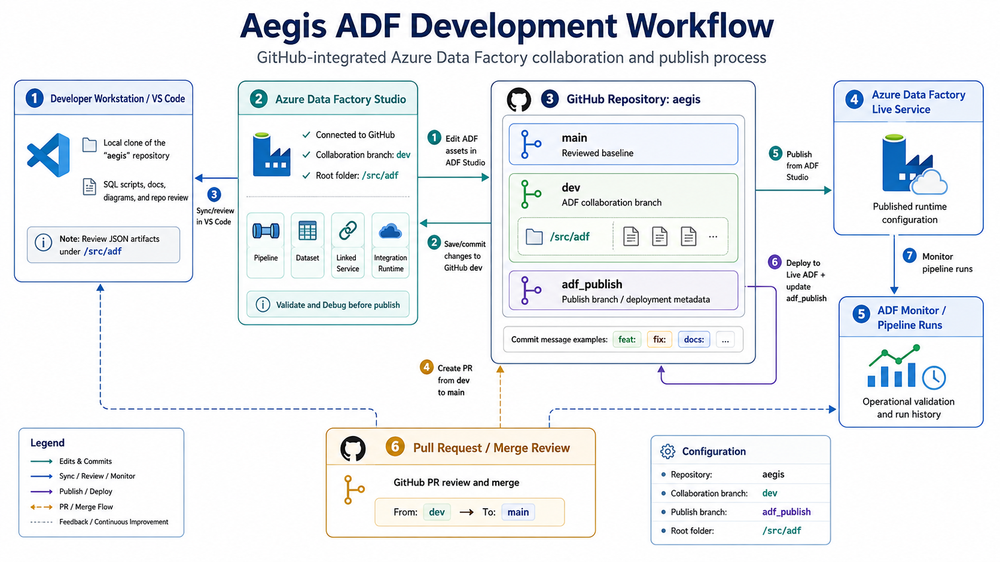

# Azure Data Factory Admissions Orchestration

## Purpose

This document describes the implemented Azure Data Factory orchestration for the Aegis Admissions migration and assurance scenario.

The implementation extends the existing SQL Server and SSIS solution with a hybrid Azure orchestration pattern:

```text
Azure Data Lake Storage Gen2
        ↓
Azure Data Factory
        ↓
Self-hosted Integration Runtime
        ↓
Local SQL Server
        ↓
Landing, staging, validation, curation, quarantine and audit
```

The ADF route processes the same deterministic Admissions baseline already proven through SSIS:

```text
1,600 valid Admissions
+    5 controlled invalid Admissions
-------------------------------------
1,605 Admissions
```

The final canonical published ADF execution was:

```text
BatchId:             39
PackageExecutionId:  39
Pipeline status:     SUCCEEDED
```

It produced:

```text
Source rows:                  1,605
Landed rows:                  1,605
Staged rows:                  1,605
Accepted and curated rows:    1,600
Quarantined rows:                 5
Record outcomes:              1,605
Data-quality exceptions:          5
Unexplained rows:                  0
```

Final statuses:

```text
BatchStatus:      COMPLETED_WITH_EXCEPTIONS
ExecutionStatus:  SUCCEEDED_WITH_EXCEPTIONS
```

The final implementation also provides controlled reporting-snapshot management:

```text
Latest successfully completed batch
        ↓
IsCurrent = 1
        ↓
reporting.AdmissionAnalysis

Previous successful batches
        ↓
IsCurrent = 0
        ↓
retained for lineage and historical audit
```

The canonical Batch 39 state is:

```text
Current curated rows:       1,600
Current quarantine rows:        5
Reporting rows:              1,600
Historical curated rows:    14,400
Historical quarantine rows:     55
Active audit executions:         0
```

The implementation demonstrates cloud orchestration over local SQL Server while preserving the existing Aegis principles of deterministic processing, complete reconciliation, controlled quarantine, repeatable reporting, least-privilege security and auditable failure handling.

---

## Scope

The implemented ADF scope covers:

- an Azure Data Lake Storage Gen2 landing location;
- Azure Data Factory orchestration;
- a self-hosted integration runtime;
- secure connectivity to local SQL Server;
- raw Admissions ingestion;
- typed landing promotion;
- staging validation and classification;
- accepted and quarantine materialisation;
- record-outcome and data-quality exception auditing;
- successful batch completion;
- controlled failure closure;
- source-controlled database permissions;
- GitHub integration for ADF JSON resources;
- published-pipeline validation.

The implementation remains focused on Admissions.

Deferred ADF extensions include:

- consultant episodes;
- diagnoses;
- procedures;
- ward stays;
- file archiving and rejection movement;
- schedule-based triggers;
- event-based triggers;
- incremental processing;
- metadata-driven multi-interface orchestration;
- replay orchestration;
- Azure-hosted SQL targets;
- production monitoring and alerting.

---

## Implemented Azure resources

### Resource group

```text
rg-aegis-dev
```

### Azure Data Factory

```text
adf-aegis-dev-ukfi
```

### Storage account

```text
staegisdevukfi
```

The storage account uses:

```text
Storage type:  StorageV2
Replication:   LRS
Namespace:     Hierarchical namespace enabled
```

### ADLS Gen2 container

```text
aegis
```

### Admissions landing path

```text
aegis/admissions/inbound/admission_mixed.csv
```

The published pipeline reads the deterministic mixed Admissions extract from this location.

---

## Hybrid architecture



The implemented hybrid pattern separates cloud orchestration from local database processing:

```text
Azure Data Factory
        │
        ├── reads from ADLS Gen2
        │
        ├── coordinates the processing sequence
        │
        ├── passes batch and execution identifiers
        │
        └── invokes SQL procedures
                ↓
Self-hosted Integration Runtime
                ↓
Local SQL Server
├── Aegis_Source
├── Aegis_Staging
└── Aegis_Audit
```

The pattern demonstrates how an organisation can introduce Azure orchestration around an established on-premises or locally hosted SQL Server estate without first relocating all databases into Azure.

---

## Source extract and ADLS landing

The ADF Admissions source file is:

```text
admission_mixed.csv
```

It is generated from:

```text
1,600 valid Admissions
+    5 controlled Admissions defects
```

The file contains 1,605 rows and the following source columns:

```text
AdmissionId
PatientId
OrganisationId
SiteId
AdmissionNumber
PatientPathwayId
AdmissionDateTime
DischargeDateTime
AdmissionMethodCode
AdmissionSourceCode
PatientClassificationCode
IntendedManagementCode
DischargeMethodCode
DischargeDestinationCode
AdministrativeCategoryCode
LegalStatusCode
AdmissionStatusCode
RecordCreatedAt
RecordUpdatedAt
IsDeleted
```

The extract is uploaded to:

```text
aegis/admissions/inbound/admission_mixed.csv
```

The raw ADF copy deliberately maps only the twenty source fields.

Database-generated technical fields such as the raw identity value and load timestamp are not supplied by ADF.

---

## Self-hosted Integration Runtime

The implemented self-hosted integration runtime is:

```text
shir-aegis-dev-ukfi
```

It runs on the local development workstation and provides the secure execution bridge between Azure Data Factory and local SQL Server.

The SHIR is used for:

- local SQL Server linked-service connectivity;
- stored-procedure execution;
- Script activity execution;
- ADLS-to-local-SQL copy processing.

The runtime does not expose SQL Server publicly to the internet.

Instead, it uses outbound communication to Azure Data Factory and executes supported data movement and database operations from the local runtime node.

---

## Linked services

### ADLS Gen2

```text
ls_adls_aegis_dev
```

Purpose:

- access the `staegisdevukfi` storage account;
- read the Admissions inbound CSV;
- use the Data Factory managed identity for storage access.

### Aegis staging database

```text
ls_sql_aegis_staging_dev
```

Target:

```text
Server:    DESKTOP-N58JDOH
Database:  Aegis_Staging
Runtime:   shir-aegis-dev-ukfi
```

Purpose:

- raw ingestion;
- raw clearing;
- typed landing promotion;
- staging validation;
- curated and quarantine materialisation.

### Aegis audit database

```text
ls_sql_aegis_audit_dev
```

Target:

```text
Server:    DESKTOP-N58JDOH
Database:  Aegis_Audit
Runtime:   shir-aegis-dev-ukfi
```

Purpose:

- start batch registration;
- record outcomes and exceptions;
- complete successful executions;
- close failed executions.

Passwords and credentials are not stored in Git.

---

## Datasets

### ADLS Admissions CSV

```text
ds_adls_admissions_inbound_csv
```

Configuration:

```text
Format:             Delimited text
Encoding:           UTF-8
First row as header: Yes
Path:               aegis/admissions/inbound/admission_mixed.csv
Columns:            20 source fields
```

### Raw SQL Admissions target

```text
ds_sql_aegis_landing_adf_raw
```

Target:

```text
Aegis_Staging.landing.AdmissionAdfRaw
```

The raw table uses permissive string-based source columns so that source values can be retained before controlled conversion.

---

## Main Admissions pipeline

The implemented main pipeline is:

```text
PL_Load_Admissions_From_ADLS
```

Pipeline parameters:

| Parameter | Type | Default |
|---|---|---|
| `SourceFileName` | String | `admission_mixed.csv` |
| `SourceFilePath` | String | `aegis/admissions/inbound/admission_mixed.csv` |
| `SourceRowCount` | Integer | `1605` |
| `PackageVersion` | String | `v0.6.0` |

The successful processing path contains seven activities:

```text
SCR_Start_Admissions_Batch
        ↓
SP_Clear_Admissions_Raw
        ↓
CPY_Load_Admissions_To_Raw
        ↓
SCR_Promote_Admissions_Raw
        ↓
SCR_Process_Admissions
        ↓
SCR_Record_Admissions_Outcomes
        ↓
SP_Complete_Admissions_Batch
```

---

## Activity 1 — Start the audit batch

```text
SCR_Start_Admissions_Batch
```

This Script activity calls:

```text
Aegis_Audit.audit.usp_StartAdfAdmissionsBatch
```

It supplies:

- ADF pipeline run identifier;
- source filename;
- source path;
- expected source row count;
- package version.

The procedure creates:

- one `audit.Batch` row;
- one `audit.PackageExecution` row.

It returns:

```text
BatchId
PackageExecutionId
BatchReference
ExecutionReference
```

The `ExecutionReference` is the ADF pipeline run identifier converted to a SQL `uniqueidentifier`.

The returned `BatchId` and `PackageExecutionId` are passed to subsequent processing activities.

---

## Activity 2 — Clear the raw table

```text
SP_Clear_Admissions_Raw
```

This Stored Procedure activity calls:

```text
Aegis_Staging.landing.usp_ClearAdfAdmissionsRaw
```

It removes existing rows from:

```text
landing.AdmissionAdfRaw
```

This prevents repeated pipeline runs from accumulating duplicate raw rows.

The activity returns the number of rows removed and the clearing timestamp.

---

## Activity 3 — Copy Admissions to raw landing

```text
CPY_Load_Admissions_To_Raw
```

This Copy activity reads:

```text
ADLS Gen2
aegis/admissions/inbound/admission_mixed.csv
```

and writes to:

```text
Aegis_Staging.landing.AdmissionAdfRaw
```

The tested copy produced:

```text
Files read:    1
Rows read:     1,605
Rows copied:   1,605
Errors:        0
```

The raw table retains the twenty source fields as permissive character values.

SQL Server generates:

- `AdmissionAdfRawId`;
- `LoadedAt`.

---

## Activity 4 — Promote raw rows into typed landing

```text
SCR_Promote_Admissions_Raw
```

This Script activity calls:

```text
Aegis_Staging.landing.usp_PromoteAdfAdmissionsRaw
```

Inputs:

```text
BatchId
PackageExecutionId
SourceFileName
```

The procedure:

1. counts the raw rows;
2. removes prior typed landing rows for the same controlled execution;
3. assigns deterministic source row numbers;
4. applies safe `TRY_CONVERT` operations;
5. populates audit lineage fields;
6. creates source record identifiers;
7. records received and landed timestamps;
8. creates a SHA-256 row hash;
9. reconciles raw and promoted row counts.

Output:

```text
RawRowCount
PromotedRowCount
ReceivedAt
LandedAt
```

The validated result was:

```text
RawRowCount:       1,605
PromotedRowCount:  1,605
```

---

## Activity 5 — Process and classify Admissions

```text
SCR_Process_Admissions
```

This Script activity calls:

```text
Aegis_Staging.stg.usp_ProcessAdfAdmissions
```

The procedure performs the core Admissions processing:

```text
landing.Admission
        ↓
stg.Admission
        ↓
validation and reference lookups
        ├── ACCEPTED
        │      ↓
        │  curated.Admission
        │
        └── QUARANTINED
               ↓
           quarantine.Admission
```

It reads reference data from:

```text
Aegis_Source.pas.Patient
Aegis_Source.ref.Organisation
Aegis_Source.ref.Site
```

The procedure returns actual processing counts:

```text
LandingRowCount
StagingRowCount
AcceptedRowCount
RejectedRowCount
QuarantinedRowCount
WarningRowCount
DuplicateRowCount
```

Validated result:

```text
LandingRowCount:       1,605
StagingRowCount:       1,605
AcceptedRowCount:      1,600
RejectedRowCount:          0
QuarantinedRowCount:       5
WarningRowCount:           0
DuplicateRowCount:         0
```

These returned values are passed into final batch completion.

No completion count is hard-coded.

---

## Admissions validation rules

The ADF SQL processing route applies the same five Admissions validation rules as the established SSIS mixed package.

| Rule | Validation |
|---|---|
| `DQ-ADM-001` | Discharge date and time must not precede admission |
| `DQ-ADM-002` | Open Admissions must not contain discharge details |
| `DQ-ADM-003` | Discharged Admissions require discharge date, method and destination |
| `DQ-ADM-004` | Patient must resolve to the source PAS |
| `DQ-ADM-005` | Organisation and site must resolve consistently |

Rows passing every rule receive:

```text
ValidationStatus:   VALID
ProcessingOutcome:  ACCEPTED
```

Rows failing one or more rules receive:

```text
ValidationStatus:   INVALID
ProcessingOutcome:  QUARANTINED
```

The staging table retains:

- lookup statuses;
- validation-failure count;
- processing outcome;
- classification timestamp;
- accepted timestamp where applicable.

The quarantine table records:

- first applicable validation-rule code;
- human-readable reason detail;
- total validation-failure count;
- source and batch lineage.

---

## Activity 6 — Record outcomes and data-quality exceptions

```text
SCR_Record_Admissions_Outcomes
```

This Script activity calls:

```text
Aegis_Audit.audit.usp_RecordAdfAdmissionsOutcomes
```

The procedure writes one row to:

```text
audit.RecordOutcome
```

for every classified Admission.

It also writes rule-specific exceptions to:

```text
dq.DataQualityException
```

Controlled re-execution is deterministic:

- existing outcome rows for the same execution are removed;
- existing Admissions exceptions for the same execution are removed;
- outcomes and exceptions are recreated from classified staging data.

Validated result:

```text
OutcomeRowCount:        1,605
AcceptedRowCount:       1,600
QuarantinedRowCount:        5
ExceptionRowCount:          5
```

The procedure verifies:

```text
Data-quality exception count
=
Quarantined row count
```

for the controlled Admissions dataset.

---

## Activity 7 — Complete the audit batch

```text
SP_Complete_Admissions_Batch
```

This Stored Procedure activity calls:

```text
Aegis_Audit.audit.usp_CompleteAdfAdmissionsBatch
```

Inputs are derived from actual upstream activity outputs:

```text
LandedRowCount
AcceptedRowCount
RejectedRowCount
QuarantinedRowCount
WarningRowCount
DuplicateRowCount
```

The procedure validates:

- source-to-landed reconciliation;
- accepted, rejected and quarantined outcome reconciliation;
- physical curated-row reconciliation;
- physical quarantine-row reconciliation;
- the presence of an active batch and package execution.

After successful reconciliation, it calls:

```text
Aegis_Staging.curated.usp_ActivateAdfAdmissionsSnapshot
```

The activation procedure:

1. marks all prior curated and quarantine snapshots as historical using `IsCurrent = 0`;
2. activates the completed execution’s curated rows using `IsCurrent = 1`;
3. activates the completed execution’s quarantine rows using `IsCurrent = 1`;
4. returns the activated curated and quarantine counts;
5. allows the completion procedure to verify those counts against the actual processing outcomes.

Snapshot activation and audit completion occur in the same SQL transaction.

Therefore:

- a fully reconciled execution becomes the current reporting snapshot;
- a failed completion cannot replace the previous valid snapshot;
- previous executions remain available for lineage and historical analysis;
- repeated ADF runs do not multiply the reporting population.

The procedure then sets:

```text
BatchStatus
ExecutionStatus
CompletedAt
```

The final canonical mixed execution completed as:

```text
BatchId:          39
PackageExecutionId: 39
BatchStatus:      COMPLETED_WITH_EXCEPTIONS
ExecutionStatus:  SUCCEEDED_WITH_EXCEPTIONS
```

---

## Published pipeline evidence



The published pipeline was run through:

```text
Add trigger
→ Trigger now
```

The activity-run history confirmed that all seven success-path activities completed successfully.

The failure-handler branches were not executed during the successful run.

---

## Final reconciliation and reporting snapshot



The published Admissions execution reconciles as follows:

| Control | Result |
|---|---:|
| Source | 1,605 |
| Landed | 1,605 |
| Staged | 1,605 |
| Accepted | 1,600 |
| Curated | 1,600 |
| Quarantined | 5 |
| Quarantine table | 5 |
| Record outcomes | 1,605 |
| Data-quality exceptions | 5 |
| Unexplained | 0 |

This confirms:

```text
Source
=
Accepted
+ Rejected
+ Quarantined
+ Warning
+ Duplicate
+ Unexplained
```

with:

```text
Unexplained = 0
```

### Current-snapshot reconciliation

Repeated ADF test executions initially demonstrated that preserving every successful curated batch without an explicit current-snapshot marker caused the reporting population to multiply.

The corrected design adds:

```text
curated.Admission.IsCurrent
quarantine.Admission.IsCurrent
```

with:

```text
0 = historical snapshot
1 = current successfully completed snapshot
```

The reporting view now filters using:

```sql
WHERE a.[IsDeleted] = 0
  AND a.[IsCurrent] = 1
```

The final Batch 39 snapshot produced:

| Snapshot control | Result |
|---|---:|
| Current curated rows | 1,600 |
| Current quarantine rows | 5 |
| Reporting rows | 1,600 |
| Historical curated rows retained | 14,400 |
| Historical quarantine rows retained | 55 |
| Active batches | 0 |
| Active package executions | 0 |

This proves that:

- only the latest successfully completed execution drives reporting;
- earlier successful executions remain available for lineage;
- the failed Batch 38 execution did not become current;
- snapshot activation is transactionally coupled to successful audit completion;
- rerunning the ADF pipeline preserves the stable 1,600-row analytical baseline.

### SQL validation

After implementing snapshot activation and closing historical test executions through the governed failure procedure, all established validation suites passed:

```text
Source schema foundation:          56 / 56
Source-data reconciliation:        63 / 63
Migration control plane:           78 / 78
Admissions reporting layer:        22 / 22
                                  --------
Combined SQL validation:          219 / 219
```

The reporting validation now reconciles `reporting.AdmissionAnalysis` to the current non-deleted curated snapshot rather than to all retained historical batches.

---

## Failure-handling pipeline

The reusable failure pipeline is:

```text
PL_Fail_Admissions_Batch
```

It contains:

```text
SCR_Fail_Admissions_Batch
```

which calls:

```text
Aegis_Audit.audit.usp_FailAdfAdmissionsBatch
```

Inputs:

```text
PipelineRunId
ErrorCode
ErrorDetail
FailedActivityName
```

The main Admissions pipeline contains a red failure dependency from each downstream activity that can fail after the audit batch has been created.

Failure branches exist for:

```text
SP_Clear_Admissions_Raw
CPY_Load_Admissions_To_Raw
SCR_Promote_Admissions_Raw
SCR_Process_Admissions
SCR_Record_Admissions_Outcomes
SP_Complete_Admissions_Batch
```

No failure branch is attached to:

```text
SCR_Start_Admissions_Batch
```

because an unsuccessful start activity may not have created an audit batch to close.

The failure procedure:

1. identifies the execution using the ADF pipeline run identifier;
2. verifies that the batch and execution are active;
3. marks the batch as `FAILED`;
4. marks the package execution as `FAILED`;
5. records the first error code and detail;
6. records the failed activity name;
7. sets completion timestamps;
8. preserves the first meaningful error on repeated callbacks.

---

## Controlled failure validation

A controlled failure was introduced by temporarily referencing a deliberately nonexistent stored procedure from:

```text
SP_Clear_Admissions_Raw
```

The activity failed with error code:

```text
2402
```

The corresponding failure branch successfully invoked:

```text
PL_Fail_Admissions_Batch
```

The audit result was:



Validated outcome:

```text
BatchStatus:      FAILED
ExecutionStatus:  FAILED
ErrorCode:        2402
ErrorDetail:      Identifies SP_Clear_Admissions_Raw
CompletedAt:      Populated
```

The handler was then invoked a second time for the same failed execution using different test error values.

The original error code and detail remained unchanged.

This proves the failure procedure is idempotent and preserves the first recorded failure.

The real stored-procedure configuration was restored after the controlled test.

---

## Least-privilege database security

ADF connects to local SQL Server through:

```text
aegis_adf_loader
```

The server-level SQL login is an environment prerequisite and its password is not stored in Git.

Database users and object permissions are represented in source control through post-deployment security scripts.

### Aegis_Source

Required permissions:

```text
SELECT  pas.Patient
SELECT  ref.Organisation
SELECT  ref.Site
```

### Aegis_Staging

Required permissions:

```text
SELECT   landing.Admission
INSERT   landing.Admission
SELECT   landing.AdmissionAdfRaw
INSERT   landing.AdmissionAdfRaw
SELECT   stg.Admission
SELECT   curated.Admission
SELECT   quarantine.Admission
EXECUTE  landing.usp_ClearAdfAdmissionsRaw
EXECUTE  landing.usp_PromoteAdfAdmissionsRaw
EXECUTE  stg.usp_ProcessAdfAdmissions
EXECUTE  curated.usp_ActivateAdfAdmissionsSnapshot
```

The curated and quarantine `SELECT` permissions support the physical count reconciliation performed during batch completion.

Execution of `curated.usp_ActivateAdfAdmissionsSnapshot` permits the successfully reconciled batch to become the sole current reporting snapshot.

### Aegis_Audit

Required permissions:

```text
EXECUTE  audit.usp_StartAdfAdmissionsBatch
EXECUTE  audit.usp_CompleteAdfAdmissionsBatch
EXECUTE  audit.usp_RecordAdfAdmissionsOutcomes
EXECUTE  audit.usp_FailAdfAdmissionsBatch
```

Security configuration files:

```text
src/database/Aegis.Source/Security/ConfigureAegisAdfLoader.sql
src/database/Aegis.Staging/Security/ConfigureAegisAdfLoader.sql
src/database/Aegis.Audit/Security/ConfigureAegisAdfLoader.sql
```

The scripts are invoked through each project’s:

```text
Post-Deployment.sql
```

This ensures that clean DACPAC deployments recreate the required database users and grants.

Generated deployment scripts were inspected before publication and confirmed to contain:

```text
CREATE USER [aegis_adf_loader]
GRANT SELECT
GRANT INSERT
GRANT EXECUTE
```

The database projects were published in dependency order:

```text
Aegis_Source
        ↓
Aegis_Staging
        ↓
Aegis_Audit
```

---

## Database project dependencies

The SQL processing procedures introduced cross-database dependencies.

### Aegis_Staging

References:

```text
Aegis_Source
```

SQLCMD variable:

```text
AegisSourceDatabase = Aegis_Source
```

### Aegis_Audit

References:

```text
Aegis_Staging
Aegis_Source
```

SQLCMD variables:

```text
AegisStagingDatabase = Aegis_Staging
AegisSourceDatabase  = Aegis_Source
```

Deployment uses `SqlPackage` with the required SQLCMD values explicitly supplied.

Deployment scripts are generated and reviewed before publication.

Locally generated:

```text
bin/
obj/
*.dacpac
*.publish.sql
```

remain excluded from normal Git history.

---

## GitHub integration

ADF Studio is connected to the existing Aegis GitHub repository.

Configuration:

```text
Repository:            aegis
Collaboration branch:  dev
Publish branch:        adf_publish
Root folder:           /src/adf
```

ADF source-controlled resources are stored under:

```text
src/adf/
├── dataset/
├── factory/
├── integrationRuntime/
├── linkedService/
├── pipeline/
└── publish_config.json
```

The imported resources include:

- datasets;
- pipelines;
- linked services;
- integration runtime metadata;
- factory configuration.

Credentials and secret values are not stored in these Git resources.

---

## Development workflow



The implemented workflow separates authoring, source control and deployment responsibilities.

### ADF Studio

Used for:

- visual pipeline authoring;
- dataset authoring;
- linked-service configuration;
- parameter and expression configuration;
- validation;
- Debug execution;
- Git-backed save and commit;
- publishing to the live Data Factory;
- operational monitoring.

### Visual Studio

Used for:

- SQL database projects;
- stored-procedure development;
- table and schema development;
- project dependency configuration;
- DACPAC build;
- post-deployment security scripts.

### SSMS

Used for:

- database verification;
- procedure testing;
- reconciliation;
- security verification;
- deployment-result validation.

### VS Code

Used for:

- repository-wide review;
- ADF JSON inspection;
- Markdown documentation;
- diagrams and screenshots;
- PowerShell;
- Git status and branch management;
- local SQL and documentation commits.

### GitHub

Used for:

```text
dev
  ↓
Pull request
  ↓
main
  ↓
v0.6.0 release
```

ADF saves source-controlled JSON changes directly to the remote `dev` branch using Git comments.

Conventional Commit examples include:

```text
feat: add Azure Data Factory orchestration resources
fix: correct ADF processing parameter mapping
docs: document ADF hybrid architecture
```

ADF publishing:

- deploys the collaboration-branch resources to the live factory;
- updates generated deployment metadata in `adf_publish`.

SQL, documentation and diagram changes are committed through the local repository workflow.

---

## Operational characteristics

The implementation currently provides:

- deterministic source data;
- parameterised batch registration;
- repeatable raw clearing;
- typed landing promotion;
- safe type conversion;
- source-row lineage;
- batch and package lineage;
- reference-data validation;
- business-rule classification;
- curated and quarantine materialisation;
- row-level outcome auditing;
- data-quality exception auditing;
- real processing-count propagation;
- successful completion audit;
- controlled failure closure;
- idempotent failure callbacks;
- least-privilege execution;
- published-run monitoring;
- complete count reconciliation.
- transactionally controlled snapshot activation;
- one current reporting snapshot;
- retained historical curated and quarantine lineage;
- failed-run protection for the last valid reporting snapshot;
- repeatable pipeline execution without reporting duplication;
- governed closure of historical test executions;
- 219 of 219 established SQL validation checks passed.

---

## Current limitations

The portfolio implementation is deliberately development-focused.

It does not yet include:

- Key Vault-backed SQL credentials;
- production network isolation;
- private endpoints;
- managed virtual network integration;
- multiple SHIR nodes;
- SHIR high availability;
- automated alerting;
- schedule-based execution;
- event-triggered file processing;
- processed and rejected file movement;
- archive retention;
- metadata-driven orchestration;
- CI/CD promotion across separate factories;
- automated DACPAC deployment;
- production monitoring dashboards;
- operational support runbooks.

These are appropriate future extensions but are not required to prove the current hybrid orchestration pattern.

---

## Design principles demonstrated

### Preserve source fidelity

Raw source values are retained before controlled conversion and classification.

### Separate orchestration from processing logic

ADF coordinates the workflow while database projects retain testable and version-controlled SQL processing logic.

### Reconcile every outcome

Every source row is represented by an accepted, quarantined, rejected, warning or duplicate outcome, with no unexplained rows.

### Fail visibly and close audit records

Unexpected downstream failures mark both the batch and package execution as failed and preserve the original error context.

### Use least privilege

ADF receives only the object-level permissions required for its implemented activities.

### Keep infrastructure and source code distinct

ADF Git resources, SQL project source, documentation and generated deployment artefacts have separate responsibilities.

### Validate the published service

The final evidence comes from a manually triggered published pipeline, not only from an ADF Debug execution.

---

## Final implementation status

```text
ADLS Gen2 landing:                    IMPLEMENTED
Self-hosted integration runtime:      RUNNING
ADF linked services:                  VALIDATED
ADF datasets:                         IMPLEMENTED
Main Admissions pipeline:             PUBLISHED
Failure-handling pipeline:            PUBLISHED
Raw ingestion:                        PASSED
Typed landing promotion:              PASSED
Staging validation:                   PASSED
Curated materialisation:              PASSED
Quarantine materialisation:           PASSED
Record-outcome audit:                 PASSED
Data-quality exception audit:         PASSED
Current-snapshot activation:          PASSED
Historical snapshot retention:        PASSED
Reporting repeatability:              PASSED
Failed-run snapshot protection:       PASSED
Controlled failure closure:           PASSED
Failure-handler idempotency:          PASSED
Historical audit reconciliation:      PASSED
Active audit executions:              0
Least-privilege permissions:          SOURCE CONTROLLED
GitHub ADF integration:               CONFIGURED
Canonical published batch:            39
Published pipeline execution:         SUCCEEDED
Current reporting rows:               1,600
Final unexplained rows:               0
Combined SQL validation:              219 / 219
```

Aegis now demonstrates two complementary Admissions orchestration routes:

```text
SQL Server SSIS
        and
Azure Data Factory + ADLS Gen2 + SHIR
```

Both routes implement the same central assurance principle:

> Preserve the imperfect source, validate and classify every record, process what is safe, quarantine what is not, and reconcile every outcome.