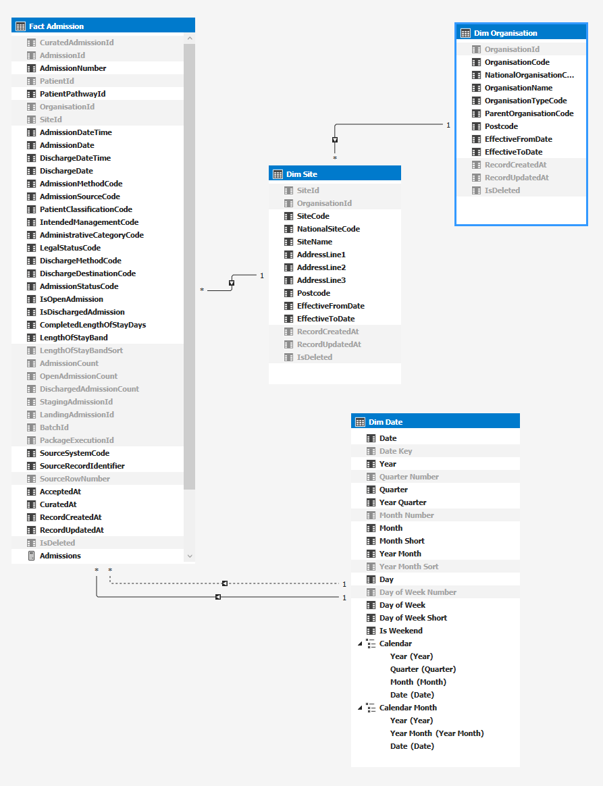

# SSAS Admissions Tabular Model

## Purpose

The Aegis Admissions analytical model provides a focused SQL Server Analysis Services Tabular semantic layer over the accepted Admissions dataset produced by the audited SSIS migration pipeline.

The model is designed to support:

- accepted Admission activity;
- open and discharged Admission analysis;
- Admission and discharge trends;
- organisation and site reporting;
- patient classification and admission-method analysis;
- completed length-of-stay analysis;
- source-to-curated lineage;
- migration and data-quality assurance reporting.

The model deliberately remains limited to the Admissions scenario so that the complete migration, semantic-model and reporting flow can be demonstrated clearly.

---

## Authoritative dataset

The accepted downstream dataset is:

```text
Aegis_Staging.curated.Admission
```

The SSAS model imports Admissions through the reporting view:

```text
Aegis_Staging.reporting.AdmissionAnalysis
```

The reporting view contains only active accepted Admissions:

```sql
WHERE IsDeleted = 0
```

Validated population:

```text
Accepted Admissions:       1,600
Open Admissions:             192
Discharged Admissions:     1,408
Distinct Patients:           708
```

---

## Project and deployment

### Visual Studio solution

```text
src/ssas/Aegis.Analysis/Aegis.Analysis.sln
```

### SSAS Tabular project

```text
src/ssas/Aegis.Analysis/Aegis.Admissions.Analysis
```

### Model compatibility

```text
SQL Server 2022
Compatibility level 1600
```

### Deployment target

```text
Server:    DESKTOP-N58JDOH
Database:  Aegis_Admissions_Analysis
Model:     Model
```

---

## Model design

The model contains four tables:

```text
Fact Admission
Dim Organisation
Dim Site
Dim Date
```

The model uses a compact snowflake design:

```text
Dim Organisation
        ↓
Dim Site
        ↓
Fact Admission

Dim Date
        ↓
Fact Admission
```

The Admissions fact is related to the Date dimension through two role-playing date relationships:

```text
Dim Date[Date]
    → Fact Admission[AdmissionDate]
      Active relationship

Dim Date[Date]
    → Fact Admission[DischargeDate]
      Inactive relationship
```

The inactive discharge relationship is activated in DAX with `USERELATIONSHIP`.

---

## Model diagram



---

## Table grain

### Fact Admission

Grain:

> One row per accepted Admission.

Source:

```text
Aegis_Staging.reporting.AdmissionAnalysis
```

The table includes:

- Admission identifiers;
- patient and pathway identifiers;
- organisation and site keys;
- admission and discharge dates and timestamps;
- admission classifications;
- discharge classifications;
- open and discharged flags;
- completed length of stay;
- length-of-stay bands;
- migration lineage;
- batch and package execution lineage.

### Dim Organisation

Grain:

> One row per organisation.

Source:

```text
Aegis_Source.ref.Organisation
```

Validated population:

```text
3 organisations
```

### Dim Site

Grain:

> One row per site.

Source:

```text
Aegis_Source.ref.Site
```

Validated population:

```text
5 sites
```

### Dim Date

Grain:

> One row per calendar date.

Implementation:

```text
Calculated DAX date table
```

Date range:

```text
2023-01-01 to 2026-12-31
```

Validated population:

```text
1,461 dates
```

---

## Relationships

| From | To | Cardinality | Active |
|---|---|---:|---|
| `Dim Organisation[OrganisationId]` | `Dim Site[OrganisationId]` | One-to-many | Yes |
| `Dim Site[SiteId]` | `Fact Admission[SiteId]` | One-to-many | Yes |
| `Dim Date[Date]` | `Fact Admission[AdmissionDate]` | One-to-many | Yes |
| `Dim Date[Date]` | `Fact Admission[DischargeDate]` | One-to-many | No |

All filter directions are single-direction from dimension to fact.

No direct relationship is created between `Dim Organisation` and `Fact Admission`, avoiding an unnecessary alternate filter path.

---

## Date hierarchies

### Calendar

```text
Year
└── Quarter
    └── Month
        └── Date
```

### Calendar Month

```text
Year
└── Year Month
    └── Date
```

Supporting sort columns ensure chronological ordering for:

- quarter;
- month;
- year-month;
- day of week.

---

## Measures

### Admissions

```DAX
Admissions :=
SUM('Fact Admission'[AdmissionCount])
```

Description:

> Count of accepted Admissions, evaluated using the active Admission Date relationship.

### Open Admissions

```DAX
Open Admissions :=
SUM('Fact Admission'[OpenAdmissionCount])
```

Description:

> Count of accepted Admissions without a discharge date.

### Discharged Admissions

```DAX
Discharged Admissions :=
CALCULATE(
    SUM('Fact Admission'[DischargedAdmissionCount]),
    USERELATIONSHIP(
        'Dim Date'[Date],
        'Fact Admission'[DischargeDate]
    )
)
```

Description:

> Count of accepted discharged Admissions, evaluated using the inactive Discharge Date relationship.

### Distinct Patients

```DAX
Distinct Patients :=
DISTINCTCOUNT('Fact Admission'[PatientId])
```

Description:

> Distinct count of patients represented within the accepted Admissions dataset.

### Average Completed Length of Stay

```DAX
Average Completed Length of Stay :=
AVERAGE('Fact Admission'[CompletedLengthOfStayDays])
```

Description:

> Average completed length of stay in days for discharged Admissions only.

### Open Admission Percentage

```DAX
Open Admission Percentage :=
DIVIDE(
    [Open Admissions],
    [Admissions]
)
```

Description:

> Percentage of accepted Admissions that remain open.

---

## Validated measure results

The deployed model returns:

```text
Admissions:                         1,600
Open Admissions:                      192
Discharged Admissions:              1,408
Distinct Patients:                    708
Average Completed Length of Stay:    7.43
Open Admission Percentage:          12.00%
```

The raw DAX result for the percentage is:

```text
0.12
```

The model formats it as a percentage for client tools.

---

## Length-of-stay design

Completed length of stay is calculated from elapsed minutes:

```sql
DATEDIFF(
    MINUTE,
    AdmissionDateTime,
    DischargeDateTime
) / 1440.0
```

This is more precise than calculating calendar-day boundaries with `DATEDIFF(DAY)`.

Validated completed length-of-stay profile:

```text
Minimum:  0.33 days
Maximum: 14.00 days
Average:  7.43 days
```

Length-of-stay bands are:

```text
Open admission
Same day
1-2 days
3-6 days
7-13 days
14+ days
```

A hidden sort column preserves the intended business order.

---

## Client-tool visibility

Technical relationship keys, helper columns and internal migration identifiers are hidden from client tools where they are not required for report authoring.

Visible lineage fields include:

- `SourceSystemCode`;
- `SourceRecordIdentifier`;
- `AcceptedAt`;
- `CuratedAt`;
- record-created and updated timestamps.

This preserves an explainable source-to-curated reporting narrative without exposing unnecessary internal model complexity.

---

## Security and data access

The model uses a dedicated SQL login:

```text
aegis_ssas_reader
```

The login has read-only access through:

```text
db_datareader
```

on:

```text
Aegis_Staging
Aegis_Source
```

The login does not have:

- server-administrator rights;
- database-owner rights;
- schema-modification rights;
- data-write rights.

The password is not stored in Git or documentation.

---

## Validation

### SQL-side reporting validation

```text
sql/tests/validate_aegis_day4_admissions_reporting.sql
```

Result:

```text
22 checks passed
0 checks failed
```

The validation covers:

- reporting schema and view deployment;
- reporting and curated row reconciliation;
- open and discharged counts;
- distinct patients;
- date ranges;
- length-of-stay values;
- lineage completeness;
- organisation and site references;
- organisation/site consistency.

### Deployed-model DAX validation

```text
src/ssas/Aegis.Analysis/validation/validate_aegis_admissions_model.dax
```

The DAX validation covers:

- core measure reconciliation;
- organisation and site filtering;
- admission-date trends;
- discharge-date trends;
- active and inactive relationship behaviour.

Validated yearly activity:

| Year | Admissions | Discharges |
|---:|---:|---:|
| 2023 | 378 | 373 |
| 2024 | 411 | 403 |
| 2025 | 391 | 396 |
| 2026 | 420 | 236 |
| **Total** | **1,600** | **1,408** |

The lower discharge count in 2026 is expected because the synthetic dataset extends only to July 2026 and 192 Admissions remain open.

---

## End-to-end lineage

```text
Legacy PAS source
        ↓
SSIS landing
        ↓
SSIS staging and validation
        ↓
Accepted curated Admissions
        ↓
Reporting view
        ↓
SSAS Tabular model
        ↓
SSRS reporting
```

Each accepted Admission retains lineage through:

- source system;
- source record identifier;
- landing record;
- staging record;
- batch;
- package execution;
- accepted timestamp;
- curated timestamp.

---

## Interview narrative

The model demonstrates that Aegis does not report directly from an uncontrolled legacy extract.

Instead:

1. source data is ingested through an audited SSIS process;
2. invalid records are quarantined;
3. accepted records are materialised in a curated layer;
4. a reporting view exposes a stable analytical contract;
5. SSAS Tabular provides governed relationships, measures and hierarchies;
6. DAX validation confirms the deployed semantic model;
7. SSRS can consume the validated semantic layer on Day 5.

This creates a clear and explainable migration-assurance chain from source to report.